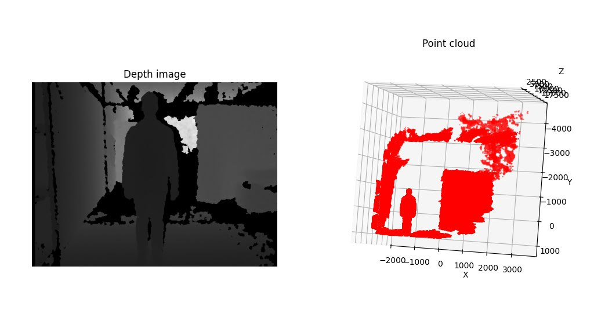

# Esercitazioni in Matlab del corso di Elaborazione immagini e dati volumetrici [4S001409]

## Acquisizione
Conversione in nuvola di punti 3D di una mappa range.  
* **Deliverable**: script matlab che produce una nuvola di punti 3D data una mappa range data e i rispettivi parametri di acquisizione del sensore (e.g., la matrice di proiezione prospettica di una kinect camera).

## Trasformazione rigida
Implementazione del metodo procustiano per la stima della trasformazione rigida tra due nuvole di punti 3D. 
* **Deliverable**: script matlab che produce la matrice di rototraslazione e visualizza le nuvole prima e dopo l’allineamento. 

## Pre-allineamento con PCA
Implementazione del metodo di stima della rototraslazione che allinea gli assi principali di ciascuna vista attraverso la Principal Component Analysis.  
* **Deliverable**: script matlab che carica una nuvola di punti, ne produce una versione ruotata (aggiungere anche del rumore gaussiano sulle coordinate) e ne calcola l’allineamento (1) sulle rispettive pose canoniche e (2) sul sistema di riferimento della prima nuvola.

ATTENZIONE! Ci sono tanti dettagli implemetativi da considerare, fare riferimento alla versione già disponibile online. 

## Registrazione pairwise 3D
Implementazione dell’algoritmo di registrazione 3D di una coppia di nuvole di punti con algoritmo Iterative Closest Point (ICP). 
* **Deliverable**: script matlab che carica due nuvole di punti (usare quelle disponibili online) e implementa l’algoritmo ICP, ovvero l’alternanza tra calcolo dei closest point e soluzione dell’allineamento procustiano.

## Registrazione con algoritmo X-84 ICP
Implementazione della variante robusta dell’algoritmo ICP in cui i closest point sono filtrati tramite lo scarto automatico degli outliers con la regola X-84. 
* **Deliverable**: script matlab come il precedente con una differente funzione per il calcolo dei closest point. 

## Multiview registration
Implementazione del metodo base per la registrazione globale dalla combinazione delle registrazioni pairwise. 
* **Deliverable**: script matlab che prende in input una sequenza di nuvole di punti,  calcola le trasformazioni a coppie in sequenza (vistaN+1 con vistaN) con ICP e porta ogni vista sul sistema di riferimento globale (e.g., quello della prima vista) dall’accumulo delle rispettive trasformazioni (usare i dati disponibil online). 

## Generazione di una mesh poligonale da una mappa range
Definire una mesh triangolare a partire dalla nuvola di punti ottenuta da una mappa range. 
* **Deliverable**: script matlab che, a partire dalle funzioni sviluppate per l’esercitazione su Acquisizione, costruisce una mesh triangolare assegnamndo la connettività dei vertici sfruttando la vicinanza dei rispettivi pixel sulla mappa range. Fare attenzione al fatto che la mappa range potrebbe non essere densa, ovvero per alcuni pixel potrebbe non esserci il rispettivo punto 3D. Apllicare, inoltre, un filtro di rimozione degli edge troppo lunghi applicando la regola X-84.

## Generazione di una mesh dell’oggetto completo
Definire un’unica mesh poligonale a partire da un insieme di nuvole di punti 3D rappresentate da viste parziali allineate. 
* **Deliverable**: una mesh poligonale ottenuta usando Meshlab (scegliere un metodo arbitrario) a partire dall’output dell’esercitazione su multiview registration.   

## Geometria differenziale
Stima della curvatura media dalla combinazione delle normali e l’operatore Laplaciano associato alla funzione coordinate. 
* **Deliverable**: script matlab che prende in input una mesh poligonale, calcola la matrice di LaplaceBeltrami con il metodo dei pesi cotangenti, calcola le normali di ogni vertice e da queste informazioni ricava la curvatura media in ogni vertice. Colorare la mesh associando ad ogni vertice il colore proporzionale alla rispettiva curvatura media. Usare i modelli 3D e gli script per il caricamento e la visualizzazione delle mesh a disposizione.  

## Analisi spettrale di forme 3D
Calcolare gli autovalori e le autofunzioni dell’Operatore di Laplace-Beltrami e plot della sequenza degli autovalori (i.e., ShapeDNA). 
* **Deliverable**: script matlab che prende in input una mesh poligonale, calcola la matrice di Laplace-Beltrami, effettua la scomposizione di tale matrice in autovalori e autofunzioni, effettua il plot della sequenza di autovalori. Mostrare che forme simili generano sequenze di autovalori (i.e., signature) simili e forme diverse generano sequenze di autovalori diverse. Usare i modelli 3D e gli script per il caricamento e la visualizzazione delle mesh a disposizione.

