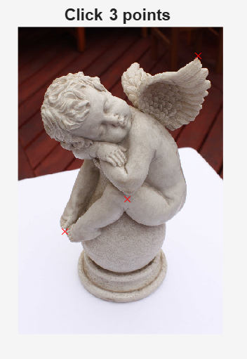
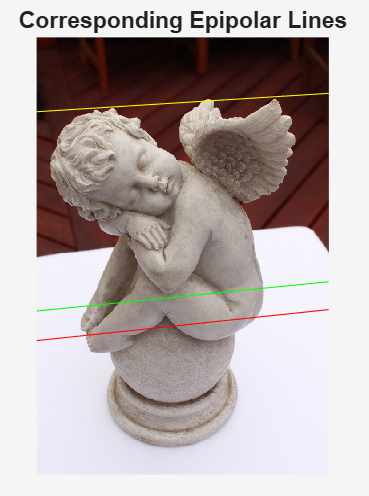

# Esercitazioni in Matlab del corso di Visione computazionale [4S00079]

## Calibrazione 1
Implementare il metodo diretto, creare un set-up di acquisizione definendo un proprio oggetto di calibrazione.  
* **Deliverable**: script matlab con l’implementazione della calibrazione, immagine contenente l’oggetto di calibrazione, immagine guida per l’inserimento manuale delle corrispondenze 3D-> 2D. 

## Calibrazione 2
Usare il camera calibration toolkit (http://www.vision.caltech.edu/bouguetj/calib_doc/) per calibrare una telecamera usando le immagini disponibili sul sito (fare riferimento  al metodo di Zhang). 
Analizzare i vari parametri stimati e le rispettive strutture dati generate dal codice. 
* **Deliverable**: matlab file (file .mat) contenenti di dati della propria calibrazione. 

## Fattorizzazione matrice MPP
Implementare il metodo per la fattorizzazione della matrice di proiezione prospettica completa in matrice K dei parametri interni, matrice di rotazione R e vettore di traslazione t 
(parametri esterni).  
* **Deliverable**: script matlab con l’implementazione dell’esercizio. 

## Riproiezione 3D->2D
Creare una simulazione di animazione in realtà aumentata in cui oggetti sintetici (i.e., punti, linee o loro combinazioni) vengono animati nello spazio 3D e riproiettati coerentemente nell’immagine. Usare le immagini e i dati di calibrazione definiti per le esercitazioni precedenti ovvero le scacchiere del toolbox di calibrazione e le immagini del vostro set-up di acquisizione. 
* **Deliverable**: script matlab con l’implementazione dell’esercizio. 

## Triangolazione
Implementare l’algoritmo di stima del punto 3D a partire dalla sua proiezione su due immagini diverse delle quali si conoscono le rispettive matrici di calibrazione. Usare il set-up di acquisizione definito per la calibrazione per fissare due viste dello stesso oggetto. Inserire nella scena un’oggetto del quale si conosce una certa misura (es. lunghezza di un pennarello) e verificare che la misura stimata sia coerente con quella conosciuta. 
* **Deliverable**: script matlab con l’implementazione dell’esercizio. 

## Geometria epipolare
Implementare il metodo per il calcolo  e il disegno delle rette epipolari. Usare le immagini e i dati sulla calibrazione delle camere disponibili su moodle.
Come esercizio opzionale usare le immagini create per l’esercitazione sulla triangolazione. 
* **Deliverable**: script matlab con l’implementazione dell’esercizio.  

## Calibrazione stereo
Usare il camera calibration toolkit per calibrare un set-up stereo (http://www.vision.caltech.edu/bouguetj/calib_doc/htmls/example5.html). Usare le immagini disponibili sul sito. 
* **Deliverable**: matlab file (file.mat) con i risultati della propria calibrazione stereo. 

## Rettificazione
Implementare il metodo per la rettificazione delle immagini su cui disegnare le nuove rette epipolari (orrizzontali). Usare le immagini e i dati sulla calibrazione delle camere disponibili su moodle. 
Come esercizio opzionale usare la coppia di immagini creata per l’esercitazione sulla triangolazione. Nota: per applicare il warping dell’immagine usare lo script disponibile su moodle.  
* **Deliverable**: script matlab con l’implementazione dell’esercitazione.  

## Omografia e mosaicing
Implementare il metodo per la stima dell’omografia tra due immagini rappresentanti  la stessa scena planare. Usare questo metodo per creare il mosaico tra le due immagini. 
Usare le immagini disponibili su moodle. Anche in questo caso usare lo script per l’applicazione del warping disponibile su moodle. 
* **Deliverable**: script matlab con l’implementazione dell’esercitazione.

## Stima della posa (exterior orientation)
Implementazione dell’algoritmo di Fiore per la stima della posa della camera. Usare i dati disponibili su moodle.
Come esercizio opzionale potete usare l’animazione generata per l’esercizio di riproiezione su un’altra immagine dello stesso set-up di acquisizione per la quale avete usato la stessa camera (ovvero una camera con gli stessi parametri interni). 
* **Deliverable**: script matlab con l’implementazione dell’esercitazione.